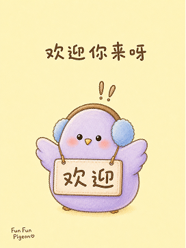
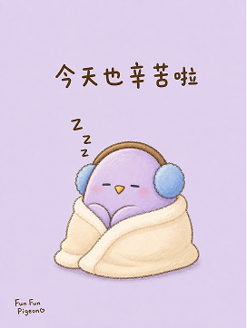
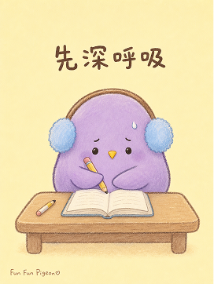
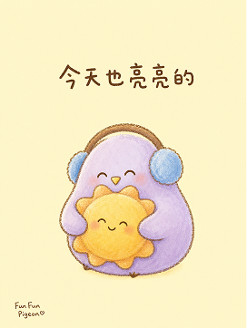

# Fun Fun Pigeon



> 把一句情绪、一个生活场景或一个小红书选题，变成可直接用于生图的治愈漫画提示词。
>
> 3:4 竖版 | 小紫鸽 IP | 韩国治愈插画 | 马卡龙配色 | Codex Skill

---

## 这个仓库是什么

Fun Fun Pigeon 是一个 Codex Skill，用来指导 AI Agent 为「小紫鸽」IP 生成稳定、统一、可复制的小红书治愈插画提示词。

它不是通用绘画 prompt，也不是复杂的海报排版模板。它的核心目标是：先理解用户输入的一句话情绪或生活场景，再自动匹配小紫鸽的表情、道具、[...]

默认视觉 IP 是 Fun Fun Pigeon 小紫鸽：一个圆滚滚的薰衣草紫水滴形角色，戴蓝色毛绒耳机，有黄色小三角嘴、黑色小圆点眼睛、短小翅膀和软糯的手[...]

一句话：**上传 IP + 输入主题，AI 自动帮你生成统一风格的治愈漫画海报提示词。**

---

## 适合谁用

特别适合：

- 刚开始做小红书内容，不知道怎么写���图提示词的人
- 想稳定运营一个治愈系 IP 角色的人
- 需要批量生产情绪陪伴、成长感悟、日常治愈内容的人
- 想让 AI 生成图片时尽量保持角色外形一致的人
- 用 Codex 做内容生产，希望复用固定 IP 画风的人

不适合：

- 想生成写实摄影、商业大片或高级品牌 KV 的人
- 想把不同 IP、真人角色或复杂群像混在一起的人
- 想要复杂背景、完整漫画分镜或大场景叙事的人
- 想让一张图承载大量文字、课程内容或信息图的人
- 需要直接输出最终图片，而不是提示词的人

---

## 它会产出什么

默认输出：

- 一段结构化中文文生图提示词
- 2-3 行创作说明，解释表情、道具和配色选择
- 小紫鸽 IP 外形描述：紫色圆体、蓝色毛绒耳机、黄嘴、棕色描边
- 画面风格描述：韩国治愈插画、儿童绘本风、蜡笔颗粒描边、油画棒质感
- 画面内容描述：纯色背景、一个核心道具、大量留白、Fun Fun Pigeon 签名
- 一句 15 字以内的治愈文案
- 2-3 条快捷调整建议

默认不输出：

- PNG / JPG 最终图片
- PPTX / PDF / SVG / HTML
- 多角色剧情漫画
- 复杂背景装饰
- 长篇文案排版图

---

## 视觉风格

这个 skill 默认使用「小紫鸽小红书治愈卡片」风格：

- 竖版 3:4 构图，像一张手绘小卡片
- 背景使用纯色平涂，避免复杂装饰
- 马卡龙 / 莫兰迪奶油色系，整体温柔、柔和、低刺激
- 棕色粗线手绘描边，带蜡笔颗粒和油画棒质感
- 角色主体保持圆润、软糯、低细节
- 每张图只放一个核心道具，避免元素过多
- 文案短、清楚、可读，适合小红书治愈内容

---

## 示例效果

### 今天很累

适合生成困倦表情、热饮道具、粉紫或奶黄色背景。

```text
Use $fun-fun-pigeon 生成一张小红书治愈漫画封面。
主题：今天很累
想表达：累了也可以慢慢休息，不用一直撑着。
```



### 考试焦虑

适合生成思考表情、书本道具、奶黄或薄荷绿背景。

```text
Use $fun-fun-pigeon 为「考试焦虑」生成一段可直接复制的生图提示词。
画面要温柔一点，文案不要太鸡汤。
```



### 今天很开心

适合生成开心表情、花朵或小蛋糕道具、浅粉或鹅黄色背景。

```text
Use $fun-fun-pigeon 生成一张开心主题的小紫鸽治愈图提示词。
文案控制在 12 个字以内。
```



更多完整提示词示例见 [references/examples.md](references/examples.md)。

---

## 安装

克隆仓库，建议把本地目录命名为 `fun-fun-pigeon`：

```bash
git clone https://github.com/hemoouren/-Skill.git fun-fun-pigeon
cd fun-fun-pigeon
```

复制 skill 到 Codex skills 目录：

```bash
mkdir -p "${CODEX_HOME:-$HOME/.codex}/skills/fun-fun-pigeon"
cp SKILL.md README.md cover.png "${CODEX_HOME:-$HOME/.codex}/skills/fun-fun-pigeon/"
cp -R references "${CODEX_HOME:-$HOME/.codex}/skills/fun-fun-pigeon/"
```

安装后，在 Codex 里使用：

```text
Use $fun-fun-pigeon 生成一张小红书治愈漫画封面。
主题：情绪不好，就听听歌吧
```

---

## 怎么用

### 从一句话生成提示词

```text
Use $fun-fun-pigeon
今天很累
```

### 指定情绪和场景

```text
Use $fun-fun-pigeon 生成一张小紫鸽治愈漫画提示词。
情绪：委屈但想被安慰
场景：晚上回到家
希望道具：抱枕
```

### 控制文案长度

```text
Use $fun-fun-pigeon 为「考试焦虑」生成提示词。
画面中文字不超过 12 个字，语气温柔但不要说教。
```

### 调整画面元素

```text
Use $fun-fun-pigeon 生成一张小红书治愈图提示词。
主题：周末在家发呆
背景用奶油米色，只保留一个零食道具。
```

---

## 工作流程

这个 skill 的流程是：

1. 读取用户给出的主题、情绪、场景或生活状态
2. 提取核心情绪、场景关键词和可能出现的道具
3. 从表情库里匹配小紫鸽表情：开心、害羞、困倦、流泪、生气、惊讶、思考或眯眼
4. 选择一个最贴近主题的道具，并保持背景极简
5. 选择对应的莫兰迪 / 马卡龙背景色
6. 生成一句短小、清楚、温柔的画面文案
7. 按固定模板组装完整提示词
8. 输出创作说明、完整提示词和快捷调整建议
9. 用自检清单确认 IP 外形、画风关键词、文案和技术参数完整

---

## 目录结构

```text
.
├── README.md
├── SKILL.md
├── cover.png
└── references/
    ├── examples.md
    └── ip-features.md
```

真正需要 Codex 识别的是根目录里的：

```text
SKILL.md
```

`references/` 里的文档用于补充 IP 特征、表情规则、配色规则和提示词示例。

---

## 注意事项

- 这个 skill 输出的是提示词，不是最终图片。
- 图片里的中文越短越稳定，建议控制在 15 字以内。
- 背景要保持纯色，不要加窗户、植物、星星、复杂纹理或大量装饰。
- 每张图只保留一个核心道具，让小紫鸽成为画面主体。
- 如果生成图片时出现错字，优先缩短文案或改成更简单的词。
- 如果角色外形漂移，优先保留 `IP 角色` 段落里的完整外形描述。
- 如果画面太乱，删除多余道具，并强调「纯色背景、大量留白」。

---

## 参考资料

- [IP 特征说明](references/ip-features.md)
- [提示词示例库](references/examples.md)

---

## 关于作者

**hemoouren** — Fun Fun Pigeon 小紫鸽 IP 创作者

- GitHub: [hemoouren](https://github.com/hemoouren)
- Repository: [hemoouren/-Skill](https://github.com/hemoouren/-Skill)

---

## License

当前仓库尚未包含开源许可证文件。如需公开分发或二次使用，建议补充明确的 `LICENSE`。
